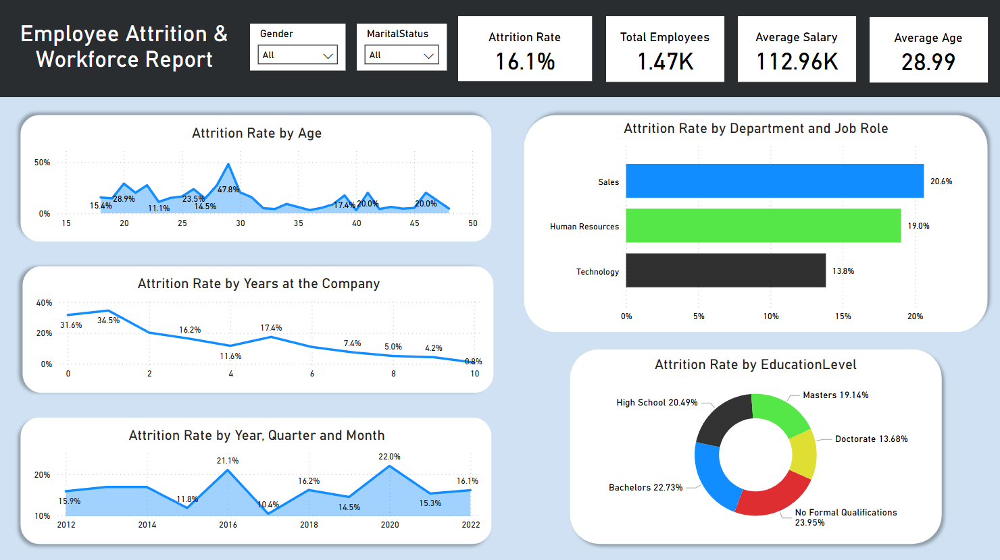

# ***Employee Attrition & Workforce Report***

# ***Overview***
This project explores employee attrition patterns and workforce dynamics using structured employee data. The goal is to identify key drivers of attrition and provide actionable insights to improve employee retention and organizational performance.

# ***Purpose of the Data***
- Understand attrition rates across departments, job roles, and demographics.
- Analyze employee satisfaction, performance, and training metrics.
- Identify factors leading to high attrition.
- Support HR and management in workforce planning and employee engagement strategies.

# ***Data Description***

| Dataset | Description |
|--------|-------------|
| `Employee.csv` | Core employee info: age, gender, salary, department, job role, experience, attrition, etc. |
| `Education.csv` | Maps `EducationLevelID` to education categories. |
| `Performance Rating.csv` | Satisfaction, performance ratings, training stats, and work-life balance data. |
| `Satisfaction Level.csv` | Categorical labels for satisfaction scales. |
| `Rating.csv` | Categorical labels for performance rating levels. |

# ***Technical Overview***

- **Excel** used for Data Cleaning and Structuring
- **SQL** used for EDA
- **Python (Pandas, Seaborn, Matplotlib)** for advanced analysis   
- **Libraries**: Pandas, Seaborn, Matplotlib
- **Analysis Performed**:
  - Descriptive statistics
  - Aggregations (group-by, window functions)
  - Attrition drivers by age, department, tenure
  - Satisfaction, training, and performance interactions
  - Time-series trends and rating comparisons

# ***Executive Summary*** 

Employee attrition in the company stands at ~16.3%, with the highest turnover observed in specific roles and departments. Key factors like low job satisfaction, high business travel, limited training impact, and low manager ratings are contributing to the attrition problem. Age and tenure also play significant roles — younger employees (<30) are more likely to leave.

Moreover, performance ratings do not necessarily correlate with training opportunities, revealing a gap in development outcomes. Several departments with lower average satisfaction scores (especially in job or relationship dimensions) also face higher attrition.

A focused strategy on retention, manager effectiveness, and employee engagement is critical to stabilize the workforce.

# ***Key Insights***

1. **Overall Attrition Rate**:  
   - 16.3% of employees have left the company.

2. **Attrition by Age Group**:  
   - Under 30: **~22% attrition**
   - 40+: **~10% attrition**

3. **Departmental Risk Areas**:  
   - **Sales** and **R&D** = high attrition  
   - **Finance** and **HR** = stronger retention

4. **Top 5 Job Roles by Attrition**:  
   - Includes **Sales Executive**, **Lab Technician**

5. **Job Satisfaction**:  
   - Departments with **< 3.0** job satisfaction = **20–25% more attrition**

6. **Work-Life Balance**:  
   - WLB score ≤ 2 = **1.6x higher attrition**

7. **Training vs Retention**:  
   - Employees with **>1 training + manager rating < 3** = high-risk group

8. **Manager vs Self Rating**:  
   - Avg gap: **0.8 points** (Self > Manager)

9. **Tenure Factor**:  
   - Employees with **<2 years** tenure = **40% of exits**

10. **Stock Options**:  
    - Higher levels (2–3) = **15–20% less attrition**

# ***Recommendations***

1. **Onboard & Retain Younger Employees**  
   - Implement strong onboarding, career visibility, and mentoring for under-30s.  
   - Focused retention here has long-term benefits.

2. **Targeted Interventions for High-Risk Departments**  
   - **Sales & R&D** need custom plans to tackle role stress, recognition, and mobility.  
   - Conduct quarterly stay interviews to catch early signs.

3. **Manager Capability Building**  
   - Upskill managers on feedback, coaching, and bias handling.  
   - Close the **0.8-point rating gap** to rebuild trust.

4. **Make Satisfaction Actionable**  
   - Run bi-monthly pulse surveys and take visible action.  
   - Share changes transparently to build engagement.

5. **Optimize the Training Loop**  
   - Tie training to role goals with clear follow-up steps.  
   - Use coaching and post-training check-ins to reinforce learning.

6. **Stock Option & Retention Linkage**  
   - Expand stock grants in high-risk/high-skill roles.  
   - Use milestone-based vesting for longer-term retention.

7. **Enhance First-Year Experience**  
   - Create a “First 365” program focused on connection, growth, and feedback.  
   - Add buddy systems and early recognition initiatives.

8. **Work-Life Balance as KPI**  
   - Track and act on WLB scores in teams with high demands.  
   - Pilot hybrid or flexible models where feasible.

# ***Data Limitations***

- No exit interview or reason-for-leaving data
- No longitudinal performance tracking (only current snapshot)
- No employee feedback text or sentiment data
- Attrition marked only as binary (Voluntary vs Involuntary not captured)
- Promotion timing and impact not available

# ***Conclusion***

The project identifies clear patterns in attrition linked to job satisfaction, age, tenure, department culture, and managerial relationships. Targeted, data-driven actions in high-risk segments can reduce turnover and improve retention. With better tracking of engagement and proactive HR strategies, the organization can shift from reactive hiring to long-term talent sustainability.

